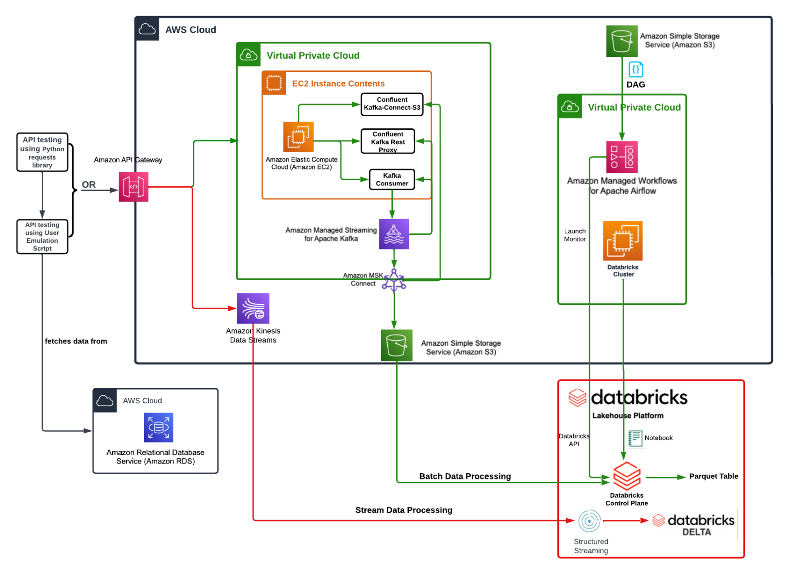
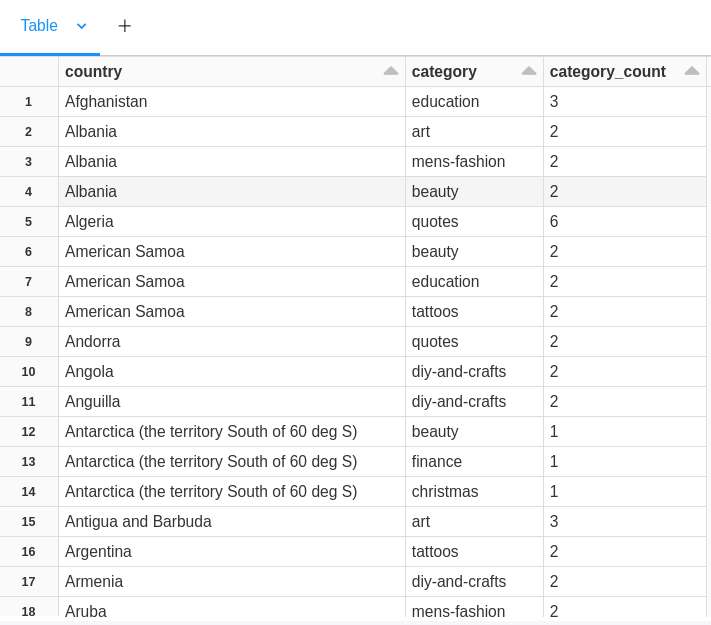
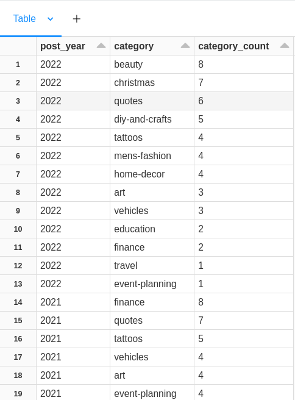
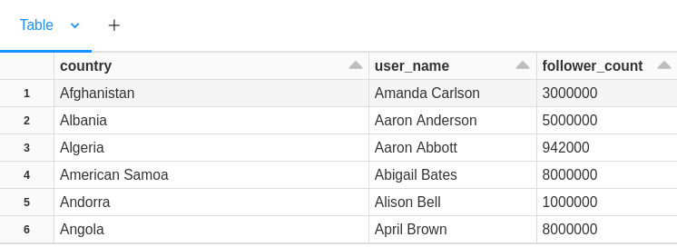
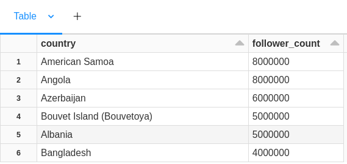
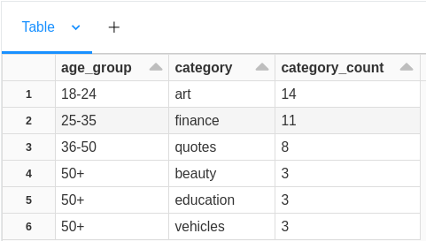
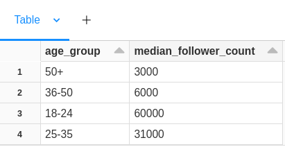
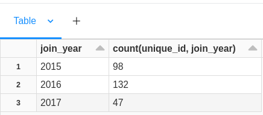
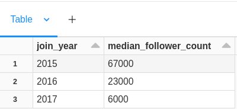
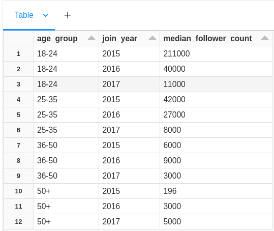

# Pinterest Data Pipeline

<div align="center">
	<table>
		<tr>
			<td><code></code></td>
			<td><code></code></td>
			<td><code></code></td>
			<td><code></code></td>
			<td><code></code></td>
			<td><code></code></td>
			<td><code></code></td>
			<td><code></code></td>	
			<td><code></code></td>
			<td><code></code></td>
		</tr>
	</table>
</div>

Designed as an image sharing and social media platform, Pinterest serves as a valuable tool for discovering and saving information, particularly focused on "ideas" like recipes, home decor, fashion, motivation, and inspiration. By utilizing images, animated GIFs, and videos, users can create pinboards to curate and explore content on the internet.

## Table of Contents

1. [Introduction](#1-introduction)
2. [Description](#2-description)

    2.1 [Pipeline architechture](#21-pipeline-architechture)  
    2.2 [Project walkthrough](#22-project-walkthrough)

3. [Tools used](#tools-used)
4. [Installation](#5-installation)
5. [File structure](#file-structure)
6. [Licence](#licence)

## 1. Introduction

The objective of this project is to construct a pair of data pipelines that will facilitate the transfer of information from Pinterest by leveraging AWS cloud computing services and Databricks for data processing.

Batch processing is primarily utilized in situations where there is a need to handle substantial data quantities or when data sources consist of legacy systems incapable of providing data in real-time streams. Under the batch processing model, data is accumulated over time and then fed into an analytics system.

Real-time analytics results heavily rely on stream processing. Through the creation of data streams, the generated data is immediately fed into analytics tools, allowing for near-instantaneous analytics outcomes using platforms like Spark Streaming. In this streaming model, the data is processed piece-by-piece, ensuring real-time processing.

## 2. Description

The primary goal of this project is to establish an end-to-end AWS-hosted data pipeline based on Pinterest's experiment processing pipeline. This pipeline is developed using a Lambda architecture, wherein the batch data is ingested via AWS API Gateway and AWS MSK, and then stored in an AWS S3 bucket. Subsequently, the batch data is retrieved from the S3 bucket and processed using Apache Spark in Databricks. To handle streaming data in near real-time, Spark Structured Streaming in Databricks is employed to read the data from AWS Kinesis and store it in Databricks Delta Tables for long-term retention.

### 2.1 Pipeline architechture  



### 2.2 Project walkthrough

To kickstart the project, I took the first steps of creating a Github repository and setting up an AWS account.
The project requires __AWS EC2__ services where a virtual machine (VM) is running to serve as the client machine in the pinterest project pipeline.
To proceed with accessing the __EC2__ instance, it requires a .pem file. This file format is commonly used to store cryptographic keys, including SSH certificates and their corresponding private keys. By selecting the instance from the __EC2__ instance console and navigating to the details section, the key-pair-name identifier was retrieved, which will serve as the filename for the `.pem` file.

After successfully establishing a secure __SSH__ connection to the VM, the next course of action involves installing the essential packages and softwares (_Java, Kafka and IAM authentication package_) on the instance to establish a connection with an existing __MSK__ cluster running on AWS.

__Apache Kafka__ will be utilized in the project to manage data streaming, which must be installed on the VM. Once Kafka is successfully installed, the __IAM MSK authentication package__ is also necessary to establish a connection with MSK, which utilizes __IAM authentication__.

By accessing the Roles section in the __IAM__ console, the instance role was obtained and subsequently modified with the `unique user-ec2-access` role ARN. This modification grants the instance the ability to connect to the MSK cluster.

With the modification of the `client.properties` file, the configuration of the Kafka client is done, facilitating effective communication between the instance and the cluster.

To ensure the accessibility of __MSK IAM__ libraries to the Kafka client, it is necessary to set up the `CLASSPATH` environment variable in the .bashrc file, to store the locationof the jar file, prior to creating any topic.
Retrieving the necessary information about the cluster from AWS MSK management console, comprising the `Bootstrap servers string` and the `Plaintext Apache Zookeeper connection string` so that the necessary topics can be created. There are 3 topics that will be used throught the project, the `<>.pin`, `<>.geo` and `<>.user`.

To ensure the preservation of data after it has been read from the topics, an __AWS S3__ bucket and __VPC__ endpoint are being established and configured. The __Confluent Amazon S3 Connector__ is then downloaded and transferred to the __S3__ bucket via the __EC2__ instance. This connector serves as a sink, responsible for extracting data from the Kafka topics and storing it in the S3 bucket. In the MSK Console, a new plugin is created under custom plugins, which is located within the S3 bucket. Subsequently, a new connector is created and configured with MSK Connect, allowing data to be streamed through the cluster and saved in the S3 bucket using this plugin-connector pair.

An __API__ has been developed using the __Kafka REST proxy__ method to ensure the seamless reception of data. This API is seamlessly connected to the EC2 instance, where a web proxy actively monitors incoming data.
To facilitate API integration with the Kafka REST Proxy on the EC2 instance, the __Confluent package__ is installed and configured. The IAM authentication process is performed to ensure secure access. Once the setup is successfully completed, the system is ready to receive data.

Emulation of the data involves the retrieval of random data from an __AWS RDS__ and its subsequent transmission to the `invoke URL` of the API,which was set up during the API's creation. Once the build process is completed successfully, the system becomes capable of seamlessly consuming data from the topics,where an S3 storage repository receives the data automatically.

Upon sending data to the API and passing it through the MSK cluster, it is automatically stored in an S3 bucket, organized into separate directories for each topic. The execution of data preparation and processing is accomplished through __Apache Spark__ on __Databricks__. To facilitate analysis, effective communication between the two platforms is necessary. This entails creating a new user with full access policy to the S3 bucket, generating the required _security credentials_, and downloading them.

The process on Databricks involves uploading the credentials and creating a table to complete the task. In a fresh python notebook, the essential modules are imported and the integration with S3 is executed. The necessary information includes the _encoded security credentials_ with the `access key` and `secret access key`, the `AWS bucket name`, and the `mounting point`.  
The listing of the mounted bucket `display(dbutils.fs.ls("/mnt/mount_name/.."))` reveals the content of the S3 bucket on Databricks, confirming its preparedness for the next step.

#### 2.2.1 Data cleaning

After integrating, it is imperative to clean the data contained in each bucket.

`df_pin` table cleaning:

- Replacing entries with no relevant data.
- Cleaning up the follower count by replacing the `k` and `M` with the relevant numeric quivalent.
- Converting each numeric type column to int.
- Cleaning up the save location, leaving only the path.
- Renaming the index column.
- Reordering the table.

`df_geo` table cleaning:

- Creating a new array column `coordinates` with the latitude and longitude.
- Dropping the latitude and longitude columns.
- Converting the timestamp column into timestamp type and cleaning it up.
- Reordering the columns.

`df_user` table cleaning:

- Creating a new column `user_name` containing both the first_name and last_name.
- Dropping the first_name and last_name columns.
- Converting the timestamp column into timestamp type and cleaning it up.
- Reordering the columns.

#### 2.2.2 Data querying

The following question are being answered:

- __What are the most popular Pinterest category people post to based on their country?__  


- __How many posts each category had between 2018 and 2022?__  


- __Who are the most followed users in each country?__  



- __What are the most popular categories by age group?__  


- __What is the median follower count for users by age group?__  


- __What are the number of users joined each year?__  


- __What us the median follower count of users based on their joining year?__  


- __What are the median follower count of users based on their joining year and age group?__  


Once the connection between Databricks and MWAA is established, a requirements.txt file is generated and uploaded to S3. With the necessary configurations in place, everything is now set for running the dag. A `DAG` has been created and uploaded to the `dags` directory on the running `MWAA` environment. When navigating through the `Airflow` UI, the item is initially categorized under the paused section. Once it is changed to active, a daily run will be triggered and executed automatically.

## Tools used

- [Amazon API Gateway](https://aws.amazon.com/api-gateway/) - Amazon API Gateway is a fully managed service that makes it easy for developers to create, publish, maintain, monitor, and secure APIs at any scale. APIs act as the "front door" for applications to access data, business logic, or functionality from your backend services.

- [Amazon Simple Storage Service (Amazon S3)](https://aws.amazon.com/s3/) - It's an object storage service provides unparalleled scalability, data availability, security, and performance. It caters to customers of various sizes and industries, enabling them to securely store and safeguard any volume of data for a wide range of purposes. Whether it's data lakes, cloud-native applications, or mobile apps.

- [Amazon Kinesis](https://aws.amazon.com/kinesis/) - Amazon Kinesis is a fully managed service that efficiently handles the processing and analysis of streaming data at any scale. By utilizing Kinesis, we can  seamlessly ingest real-time data, including video, audio, application logs, website clickstreams, and IoT telemetry data. This data can then be utilized for various applications such as machine learning (ML), analytics, and more.

- [Amazon Elastic Compute Cloud (Amazon EC2)](https://aws.amazon.com/ec2/) - EC2 is a cloud computing platform to run virtual computers and application in the cloud. It provides on-demand, scalable computing capacity to  develop and deploy applications.

- [Amazon Managed Streaming for Apache Kafka (MSK)](https://aws.amazon.com/msk/) - Amazon MSK is a comprehensive managed service that empowers you to develop and operate applications that leverage Apache Kafka for processing streaming data.Amazon MSK, provides access to control-plane operations, including cluster creation, updates, and deletion. Additionally, Apache Kafka data-plane operations can utilized  for efficient data production and consumption.

- [Databricks](https://www.databricks.com/) - Databricks delivers a web-based platform for working with Spark, that provides automated cluster management and IPython-style notebooks.

WIP

## 5. Installation

Follow the steps to start the pipeline process:

WIP

## File structure

The project's structure:

```text
📦pinterest-data-pipeline754
📂creds
 ┃ ┗ 📜settings.ini
 ┣ 📂databricks_notebooks
 ┃ ┣ 📜AWS_S3_mounting_Notebook.ipynb
 ┃ ┗ 📜Batch_data_cleaning_&_querying.ipynb
 ┣ 📂images
 ┃ ┣ 📜batch_q1.png
 ┃ ┣ 📜batch_q2.png
 ┃ ┣ 📜batch_q3a.png
 ┃ ┣ 📜batch_q3b.png
 ┃ ┣ 📜batch_q4.png
 ┃ ┣ 📜batch_q5.png
 ┃ ┣ 📜batch_q6.png
 ┃ ┣ 📜batch_q7.png
 ┃ ┣ 📜batch_q8.png
 ┃ ┗ 📜cloud-pinterest-pipeline.webp
 ┣ 📂src
 ┃ ┣ 📜12a740a19697_dag.py
 ┃ ┗ 📜user_posting_emulation.py
 ┣ 📜.gitignore
 ┣ 📜LICENSE
 ┗ 📜README.md
```

## Licence

MIT License - See LICENCE
